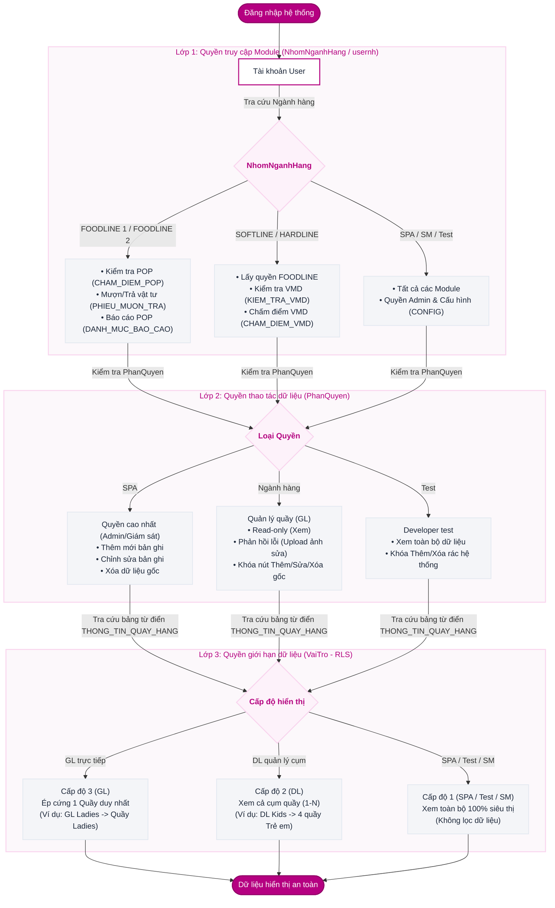

# HƯỚNG DẪN CHI TIẾT CƠ CHẾ BẢO MẬT & PHÂN QUYỀN 3 LỚP
## Hệ Thống Quản Lý Trưng Bày AEON POP & VMD Standard (Mới)

Tài liệu này bóc tách chi tiết cơ chế phân quyền bảo mật 3 lớp trong thiết kế cơ sở dữ liệu mới của ứng dụng **AEON POP & VMD Standard**. Cơ chế này giải quyết bài toán bảo mật cấp dòng (Row-Level Security - RLS) và phân quyền chức năng một cách tự động hóa, loại bỏ hoàn toàn hơn 35 nhánh điều kiện `If` lồng nhau ở mã nguồn cũ.

---

## 🗺️ Sơ Đồ Tổng Quan Quy Trình Phân Phối Dữ Liệu 3 Lớp


### Sơ đồ luồng xử lý (Mermaid)



---

## 🔑 Chi Tiết 3 Lớp Phân Quyền Bảo Mật

### 🏢 Lớp 1: Quyền truy cập Module (Module Access)
*   **Mục đích:** Quyết định người dùng được quyền nhìn thấy và truy cập vào các màn hình chức năng nào trong menu ứng dụng và màn hình **"Công việc hàng ngày"**.
*   **Bản đồ trường dữ liệu:** Cột `NhomNganhHang` trong bảng `NGUOI_DUNG` (Choice: `FOODLINE 1` / `FOODLINE 2` / `SOFTLINE` / `HARDLINE` / `SM` / `SPA`).
*   **Logic Ánh xạ:**
    *   `FOODLINE 1`, `FOODLINE 2`: Chỉ truy cập các chức năng chấm điểm POP, mượn trả vật tư và xem báo cáo liên quan tới ngành hàng ăn uống, hàng tiêu dùng.
    *   `SOFTLINE`, `HARDLINE`: Có toàn bộ quyền của Foodline, đồng thời kích hoạt các chức năng chấm điểm VMD (Visual Merchandising) do đặc thù ngành hàng thời trang & gia dụng có tiêu chuẩn trưng bày VMD cực kỳ khắt khe.
    *   `SPA`, `SM`: Truy cập tất cả các module, bao gồm cả quyền Quản trị/Cấu hình hệ thống (Config).
*   **Bảng cấu hình database tương ứng:**
    *   `DANH_MUC_CONG_VIEC` (Danh sách các module màn hình)
    *   `CONG_VIEC_PHAN_QUYEN` (Mảng phân quyền ánh xạ: `ModuleID` + `NhomQuyen`)
*   **Minh họa code kiểm tra quyền (React / JS):**
    ```javascript
    // Kiểm tra xem màn hình (screenName) có được hiển thị cho User hiện tại không
    export const isScreenAllowed = (user, screenName, allowedScreensByDept) => {
      // Nhóm quản trị được phép truy cập tất cả
      if (['SPA', 'SM', 'Test'].includes(user.permission)) return true;
      
      // Kiểm tra trong danh sách liên kết từ bảng CONG_VIEC_PHAN_QUYEN
      return allowedScreensByDept.includes(screenName);
    };
    ```

---

### 🛠️ Lớp 2: Quyền thao tác dữ liệu (CRUD Permission)
*   **Mục đích:** Quyết định người dùng có thể thực hiện những thao tác ghi nhận nào trên dữ liệu khi đã vào được màn hình (Thêm mới, Chỉnh sửa thông tin, Xóa bản ghi).
*   **Bản đồ trường dữ liệu:** Cột `PhanQuyen` trong bảng `NGUOI_DUNG` (Choice: `SPA` / `Ngành hàng` / `Test`).
*   **Phân quyền chi tiết:**
    1.  **Quyền SPA (Admin/Giám sát viên):**
        *   *Thao tác:* Được phép thực hiện toàn bộ thao tác Thêm, Sửa, Xóa bản ghi gốc (POP Audits, VMD Audits, Phiếu mượn vật tư).
        *   *UI:* Các nút bấm `Thêm mới`, `Sửa`, `Xóa` được hiển thị đầy đủ và active.
    2.  **Quyền Ngành hàng (Quản lý quầy / Group Leader - GL):**
        *   *Thao tác:* Bị giới hạn ở mức **Chỉ xem (Read-only)** dữ liệu của quầy mình và chỉ được phép **Phản hồi lỗi** (tải lên ảnh sau khi đã sửa lỗi trưng bày, thêm ghi chú giải trình).
        *   *UI:* Khóa (Disabled) hoặc ẩn hoàn toàn nút Thêm mới/Xóa phiếu chấm điểm gốc. Nút `Cập nhật ảnh khắc phục` được active.
    3.  **Quyền Test (Developer/Tester):**
        *   *Thao tác:* Được xem toàn bộ dữ liệu hệ thống để kiểm thử tích hợp nhưng bị khóa chức năng Thêm mới và Xóa bản ghi để tránh làm rác dữ liệu trên môi trường Production.

---

### 📊 Lớp 3: Quyền giới hạn dữ liệu (Row-Level Security - RLS)
*   **Mục đích:** Giải quyết câu hỏi: *"Trong cùng một màn hình chấm điểm POP, tại sao GL Ladies chỉ thấy lỗi của quầy thời trang nữ, còn SPA lại thấy lỗi của toàn bộ siêu thị?"*
*   **Bản đồ trường dữ liệu:**
    *   Bảng `NGUOI_DUNG` lưu mã vai trò `VaiTro` (FK trỏ tới `DANH_MUC_VAI_TRO`).
    *   Bảng `THONG_TIN_QUAY_HANG` (hoặc `THONG_TIN_QUAY_HANG_VMD` đối với VMD) đóng vai trò là bảng **Từ điển**. Chứa thông tin ánh xạ: `QuayHang` (Tên quầy) <-> `VaiTroMacDinh` (Vai trò quản lý).

#### 3 Cấp độ lọc dữ liệu Row-Level Security:
1.  **Cấp độ 1: Quản trị viên (Role: SPA, Test, Store Manager)**
    *   *Cơ chế:* Hệ thống nhận diện role đặc biệt này và bỏ qua (bypass) mọi bộ lọc.
    *   *Dữ liệu:* `SELECT * FROM CHAM_DIEM_POP` (Nhìn thấy 100% dữ liệu của 37 quầy hàng).
2.  **Cấp độ 2: Quản lý cụm (Role: DL Kids,...)**
    *   *Cơ chế:* Bộ lọc `OR` (1-N). Khi tài khoản đăng nhập có role `DL Kids`, hệ thống tra cứu bảng từ điển và lấy ra danh sách các quầy thuộc cụm Kids.
    *   *Dữ liệu:* Nhìn thấy dữ liệu của 4 quầy: `Kid SBA`, `Kid Fashion`, `Kid Baby`, `Kid Toy`.
3.  **Cấp độ 3: Quản lý quầy trực tiếp (Group Leader - GL)**
    *   *Cơ chế:* Bộ lọc ép cứng 1-1 (`Fixed Filter`). Hệ thống chỉ trả về các bản ghi trùng khớp với quầy mà GL đó sở hữu.
    *   *Dữ liệu:* `GL Ladies` chỉ nhìn thấy dữ liệu có `QuayHang = 'Ladies'`.

> [!IMPORTANT]
> **Quy tắc: 1 User = 1 Role Duy Nhất**
> Hệ thống mới tuân thủ nghiêm ngặt nguyên lý thiết kế 1-1 để tránh tranh chấp quyền và đơn giản hóa cấu trúc dữ liệu. Để giải quyết bài toán một nhân sự quản lý nhiều quầy, hệ thống sử dụng các **Group Role** (như `DL Kids`) thay vì gán nhiều role lẻ cho một tài khoản.

---

## ⚡ So Sánh Kỹ Thuật: Hệ Thống Cũ vs Thiết Kế Database Mới

### 1. Phân luồng dữ liệu bằng Code (Power Apps / Power Fx)

*   **Cách làm cũ (Anti-pattern):** Lập trình viên viết 35 lệnh `If` lồng nhau cực kỳ dài dòng ở thuộc tính Items của Gallery:
    ```powerapps
    // CODE CŨ - Dài hàng trăm dòng, rất khó bảo trì
    If(
        userrolevalue = "GL Ladies", Filter('CHẤM ĐIỂM POP', 'Quầy hàng' = "Ladies"),
        userrolevalue = "GL Beverge", Filter('CHẤM ĐIỂM POP', 'Quầy hàng' = "Beverge"),
        userrolevalue = "GL SBA", Filter('CHẤM ĐIỂM POP', 'Quầy hàng' = "SBA (Shoes/Bag/ Acc)"),
        ...
        userrolevalue = "SPA", 'CHẤM ĐIỂM POP'
    )
    ```
    *Hệ lụy:* App chạy rất chậm, giật lag trên thiết bị di động do phải xử lý chuỗi logic cồng kềnh ở client-side. Mỗi lần siêu thị mở thêm quầy mới (ví dụ: Quầy đồ chơi thông minh), lập trình viên bắt buộc phải mở code sửa đổi trực tiếp ở 10+ màn hình và deploy lại.

*   **Cách làm mới (Tối ưu hóa bảng Từ điển):** Triệt tiêu hoàn toàn code cứng. Khi người dùng đăng nhập, hệ thống chỉ tra cứu (LookUp) 1 lần duy nhất vào bảng từ điển để lấy ra danh sách các quầy được phép truy cập và lưu vào biến toàn cục:
    ```powerapps
    // CODE MỚI (Viết 1 lần duy nhất tại App Start hoặc Login)
    Set(gblUserAllowedQuays, 
        ShowColumns(
            Filter(THONG_TIN_QUAY_HANG, VaiTroMacDinh.Value = gblCurrentUser.VaiTro.Value),
            "QuayHang"
        )
    );
    
    // Tại thuộc tính Items của Gallery trên màn hình chấm điểm POP
    Filter(CHAM_DIEM_POP, 
        QuayHang.Value in gblUserAllowedQuays || gblCurrentUser.PhanQuyen = "SPA" || gblCurrentUser.PhanQuyen = "Test"
    )
    ```

### 2. Mô phỏng truy vấn dữ liệu SQL (Row-Level Security)
Khi chuyển đổi logic này sang các hệ quản trị cơ sở dữ liệu quan hệ (hoặc backend API), câu lệnh truy vấn dữ liệu chấm điểm POP sẽ được tối ưu như sau:

```sql
-- Câu truy vấn tối ưu lớp thứ 3 (Row-Level Security)
SELECT p.* 
FROM CHAM_DIEM_POP p
LEFT JOIN THONG_TIN_QUAY_HANG q ON p.QuayHang = q.QuayHang
WHERE 
    -- Cấp độ 3 & 2: Lọc theo Vai trò đăng nhập
    q.VaiTroMacDinh = :currentUserRoleID
    
    -- Cấp độ 1: Nếu là SPA hoặc Test thì bỏ qua bộ lọc (xem 100%)
    OR :currentUserPermission IN ('SPA', 'Test', 'SM');
```

---

## 📖 Bảng Cấu Hình Mapping Tiêu Biểu Trong Bảng "Từ Điển"
Bảng `THONG_TIN_QUAY_HANG` lưu trữ cấu hình mapping giúp hệ thống tự động hóa hoàn toàn việc phân quyền cấp dòng (Row-Level Security):

| ID | Ngành Hàng (NganhHang) | Quầy Hàng (QuayHang) | Vai Trò Quản Lý (VaiTroMacDinh) | Email Nhận Cảnh Báo (Email) | Cấp Độ Lọc Dữ Liệu |
| :---: | :--- | :--- | :--- | :--- | :--- |
| **1** | Food | Beverge | GL Beverge | beverage.binhtan@aeon.com.vn | Cấp độ 3 (1-1) |
| **13** | Softline | Ladies | GL Ladies | lady.binhtan@aeon.com.vn | Cấp độ 3 (1-1) |
| **17** | Softline | SBA | GL SBA | sba.binhtan@aeon.com.vn | Cấp độ 3 (1-1) |
| **23** | Hardline | Household 2F | GL House2F | household.binhtan@aeon.com.vn | Cấp độ 3 (1-1) |
| **26** | Hardline | Home Fashion | GL HFashion | homefashion.binhtan@aeon.com.vn | Cấp độ 3 (1-1) |
| **30** | Hardline | Stationery | GL Station | multimedia.binhtan@aeon.com.vn | Cấp độ 3 (1-1) |
| **-** | Softline | *Cụm Kids* | DL Kids | kid.binhtan@aeon.com.vn | Cấp độ 2 (1-N) |
| **-** | Hệ thống | *Toàn siêu thị* | SPA / Test | admin.binhtan@aeon.com.vn | Cấp độ 1 (Bypass) |

> [!TIP]
> **Lợi ích vận hành của thiết kế mới:** 
> Khi thay đổi nhân sự (ví dụ: chuyển GL Ladies sang quản lý quầy Men), quản trị viên chỉ cần cập nhật cột `VaiTro` của User trong bảng `NGUOI_DUNG` mà không cần viết lại bất kỳ dòng code nào. Hệ thống sẽ tự động điều chỉnh luồng hiển thị dữ liệu và địa chỉ email nhận thông báo cảnh báo lỗi trưng bày tương ứng.

---

## 🎯 Thực tế vận hành: Kịch bản phân quyền theo Luồng Nghiệp Vụ

Để giúp nhà phát triển dễ dàng triển khai, dưới đây là luồng xử lý chi tiết (step-by-step) của hệ thống khi có 2 loại tài khoản khác nhau thực hiện thao tác:

### Kịch bản A: Giám sát viên (Role: Staff SPA, Permission: SPA) thực hiện chấm điểm tại Quầy Beverage

1.  **Lớp thứ nhất (Vào màn hình):** 
    *   Hệ thống kiểm tra cột `NhomNganhHang` trong bảng `NGUOI_DUNG` của tài khoản này là `SPA` (hoặc kiểm tra cột `PhanQuyen` là `SPA`).
    *   **Kết quả:** Cho phép hiển thị và truy cập tất cả các màn hình công việc (Chấm điểm POP, Chấm điểm VMD, Mượn trả vật tư, Cấu hình).
2.  **Lớp thứ hai (Thao tác):**
    *   Hệ thống kiểm tra cột `PhanQuyen` của tài khoản là `SPA`.
    *   **Kết quả:** Mở khóa tất cả các nút hành động: `Thêm mới đánh giá POP`, `Lưu`, `Xóa bản ghi`, `Khắc phục lỗi`.
3.  **Lớp thứ ba (Dữ liệu hiển thị):**
    *   Hệ thống nhận thấy tài khoản này có `PhanQuyen = 'SPA'`. Bộ lọc Row-Level Security được tắt (Bypass).
    *   **Kết quả:** Giám sát viên có thể xem lịch sử chấm điểm của toàn bộ siêu thị và chọn bất kỳ quầy hàng nào (trong đó có `Beverage`) từ Dropdown để tạo phiếu đánh giá lỗi.
4.  **Luồng cảnh báo tự động:**
    *   Khi Giám sát viên lưu lỗi POP của quầy `Beverage`, hệ thống sẽ tự động đối chiếu tên quầy `Beverage` vào bảng `THONG_TIN_QUAY_HANG`.
    *   Tìm thấy dòng cấu hình của `Beverage` có trường `Email` là `beverage.binhtan@aeon.com.vn`.
    *   Hệ thống kích hoạt gửi email cảnh báo lỗi trưng bày trực tiếp đến địa chỉ email này.

### Kịch bản B: Quản lý quầy (Role: GL Ladies, Permission: Ngành hàng) đăng nhập xử lý lỗi

1.  **Lớp thứ nhất (Vào màn hình):**
    *   Tài khoản có `NhomNganhHang` là `SOFTLINE`.
    *   **Kết quả:** Menu điều hướng ẩn đi mục "Cấu hình hệ thống". Dashboard "Công việc hàng ngày" hiển thị 4 nút chính: *Chấm điểm POP*, *Chấm điểm VMD*, *Mượn trả vật tư*, *Báo cáo*.
2.  **Lớp thứ hai (Thao tác):**
    *   Tài khoản có `PhanQuyen` là `Ngành hàng`.
    *   **Kết quả:** Khi vào màn hình Chấm điểm POP, nút `Thêm mới` và `Xóa` bị vô hiệu hóa (Disabled/Hidden). Nút `Cập nhật ảnh khắc phục` đối với từng dòng lỗi trưng bày được kích hoạt.
3.  **Lớp thứ ba (Dữ liệu hiển thị):**
    *   Hệ thống chạy hàm `LookUp(THONG_TIN_QUAY_HANG, VaiTroMacDinh.Value = "GL Ladies")` và trả về duy nhất giá trị quầy hàng `"Ladies"`.
    *   **Kết quả:** Danh sách đánh giá POP chỉ hiển thị duy nhất các dòng dữ liệu của quầy `"Ladies"`. Dữ liệu của các quầy khác như *Men*, *Beverage*, *Household 2F* bị giấu hoàn toàn để đảm bảo sự tập trung công việc.
4.  **Thao tác khắc phục lỗi:**
    *   GL Ladies khắc phục lỗi trưng bày thực tế, mở app, bấm nút phản hồi lỗi, chụp ảnh quầy kệ sau khi đã sửa lỗi và bấm `Lưu`.
    *   Hệ thống cập nhật cột `anhSuaLoi` và ghi chú khắc phục vào bảng `LOI_TRUNG_BAY_POP`. Trạng thái lỗi tự động cập nhật về dạng chờ kiểm tra lại.
